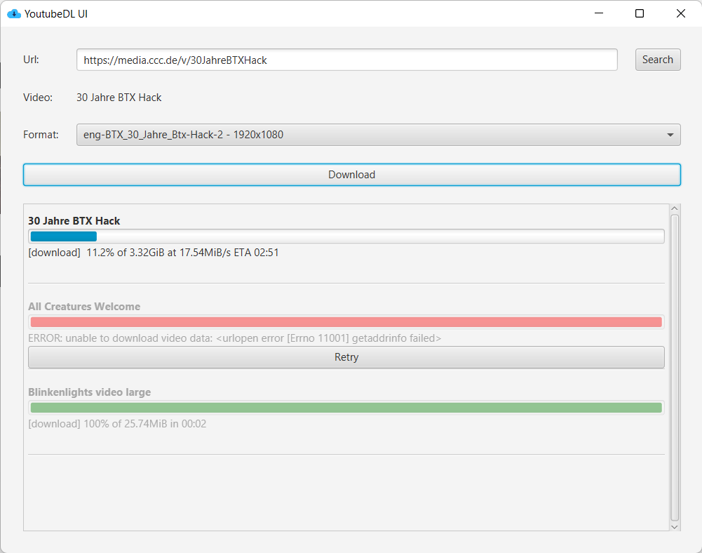

# YoutubeDL-UI

This is just a JavaFX UI project for the youtoube-dl exe.



## Usage
To use the UI download the zipped release and unzip it.

Start the application with 

* `bin/YoutubeDL-UI-launcher` on linux
* `bin/YoutubeDL-UI-launcher.bat` on windows

## Configuration
As default the application expects the youtube-dl.exe in the start folder and the downloaded files are stored in the same folder.

It is possible to change the configuration by creating a config.xml file in the same folder as application is started.

```<?xml version="1.0" encoding="utf-8" ?>
<!DOCTYPE properties SYSTEM "http://java.sun.com/dtd/properties.dtd">
<properties>
    <entry key="executable">C:/folder/to/yt-dlp.exe</entry>
    <entry key="outputPath">downloads</entry>
    <entry key="outputTemplate">%(title)s-%(id)s.%(ext)s</entry>
</properties>
```
If a config value is not set, the default is used. As the example shows, yt-dlp is also supported.

